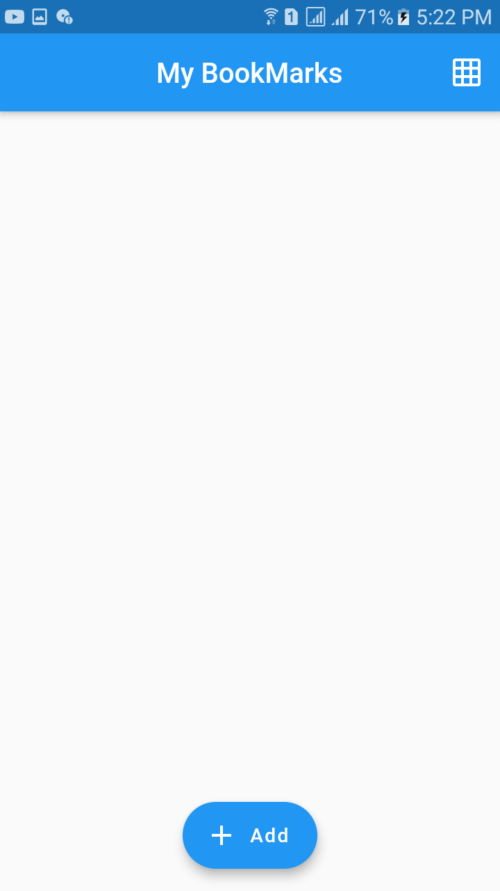

# bookmark_app

A new Flutter application.

## Getting Started

This project is a starting point for a Flutter application.

A few resources to get you started if this is your first Flutter project:

- [Lab: Write your first Flutter app](https://flutter.dev/docs/get-started/codelab)
- [Cookbook: Useful Flutter samples](https://flutter.dev/docs/cookbook)

You will learn bellow section:
- Creating the Bookmark Model Class
- Creating the Bookmarks list
- Flutter Screen Navigation using Navigator
- Gesture Detectors and InkWell widgets in Flutter
- Integrating a plugin - Displaying a Webpage with WebView
- Adding a Loader Using the Stack Widget
- Saving a new Bookmark
- Validating User Input Using a SnackBar
- Retrieving the new Bookmark
- ListView.builder
- GridView Widget
- Toggling Between a List and Grid

###################ScreeenShots#############################

     
